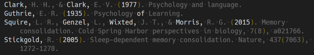

# citation-sort-hint README

For those who need to sort citation list manually.

## Features

`citation-sort-hint.focus` reduces unnecessary information for organizing reference list.

+ Lines that do not start with ASCII will be skipped.
+ The line will be split by spaces, and a blur will be applied to all elements except those listed below.
    + Familyname
        + Elements that has abbreviation (_i.e._ single capital ends with `.`) either before or after.
    + Published year
        + Elements with four consecutive numbers
    + Context is not considered. If the above conditions are met, non-personal names or 4-digit number other than publshed year will also be matched.
+ In order to reset blur, run `citation-sort-hint.reset` command.

---

**Enjoy!**
