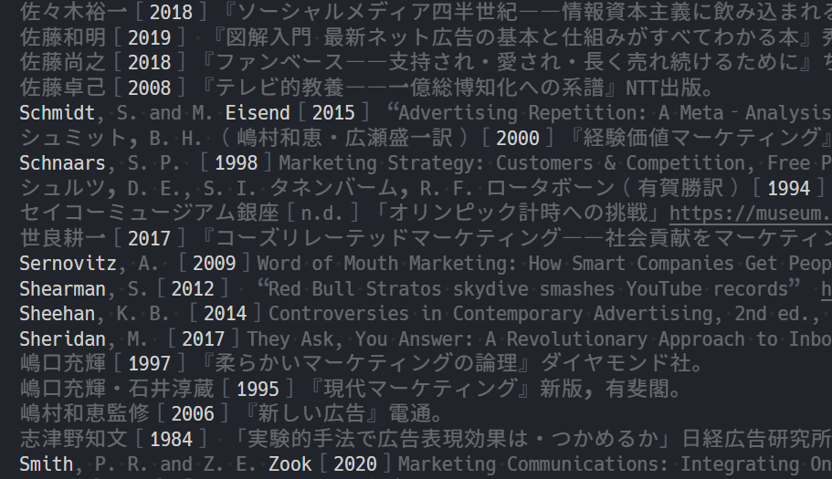

# citation-sort-hint README

For those who need to sort citation list manually.

## Features

`citation-sort-hint.focus` highlights following patterns by bluring unnecessary information.

- Surname (first-letter-capitalized words adjacent to abbreviation) such as:
    - `Shakespeare` in `W. Shakespeare`
    - `Shakespeare` in `Shakespeare, W.`
- Year (4 consecutive digits)

---

**Enjoy!**
